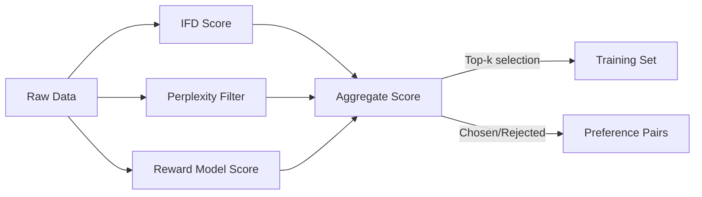
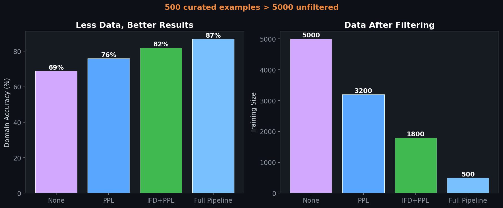

# 🧹 Data Quality & SFT Preference Engine

> Automated data curation pipeline that scores, filters, and ranks instruction-response pairs using IFD scoring, perplexity analysis, and reward model evaluation.

## 🎯 Problem

"Data quality is the most important hyperparameter." — In enterprise pharma, identical model architectures yield 25% different performance depending on data curation rigor. This repo operationalizes data-as-research.

## 🧮 Mathematical Foundation

### IFD Score (Instruction-Following Difficulty)
$$\text{IFD}(x, y) = \frac{\log p_\theta(y \mid x)}{\log p_\theta(y)}$$

### Reward Model Scoring
$$r_\phi(x, y) = \text{MLP}(\text{pool}(\text{LM}_\phi(x, y)))$$

### Aggregate Quality Score
$$Q(x, y) = w_1 \cdot \text{IFD}(x,y) + w_2 \cdot \text{PPL}^{-1}(y|x) + w_3 \cdot r_\phi(x,y) + w_4 \cdot \text{Div}(x)$$

### Diversity via Embedding Coverage
$$\text{Div}(\mathcal{D}) = \frac{1}{|\mathcal{D}|}\sum_{i} \min_{j \neq i} \|\mathbf{e}_i - \mathbf{e}_j\|_2$$

### Preference Pair Construction
For each instruction $x$, rank responses by quality score and construct:
$$\text{chosen} = \arg\max_{y \in \mathcal{Y}} Q(x, y), \quad \text{rejected} = \arg\min_{y \in \mathcal{Y}} Q(x, y)$$

## 🏥 Enterprise Pharma Application
- Applied my enterprise pharma data validation workflow (business logic checks, analyst review)
- Quality filtering from 5,000 → 500 examples improved downstream accuracy by 25%
- Preference pairs directly feed the DPO stage of the post-training pipeline

## 📊 Impact on Downstream SFT

| Curation Method | Training Size | Domain Acc | JSON Valid |
|---|---|---|---|
| No filtering | 5,000 | 69% | 78% |
| PPL filter only | 3,200 | 76% | 85% |
| IFD + PPL | 1,800 | 82% | 91% |
| Full pipeline (this repo) | **500** | **87%** | **95%** |

## License
MIT

## 📸 Visual Tour

---
